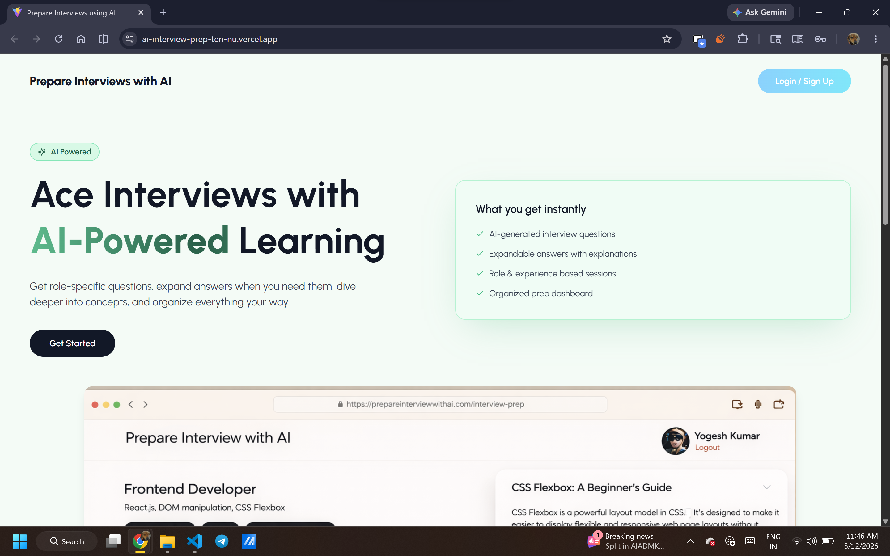
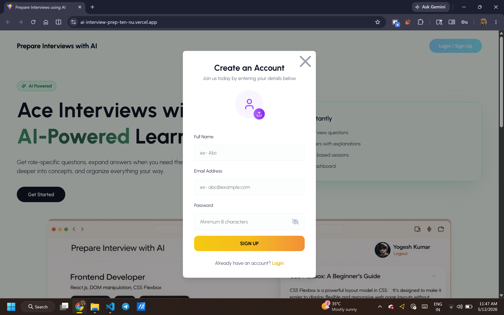
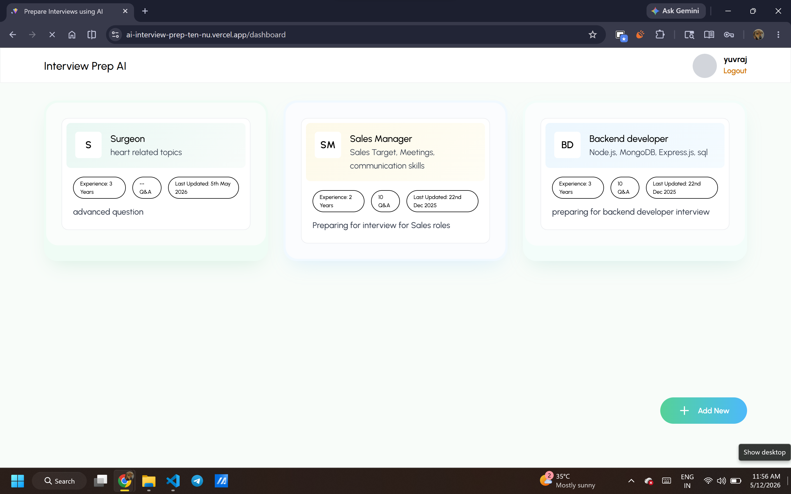
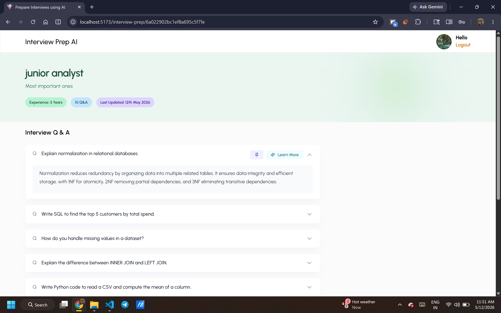
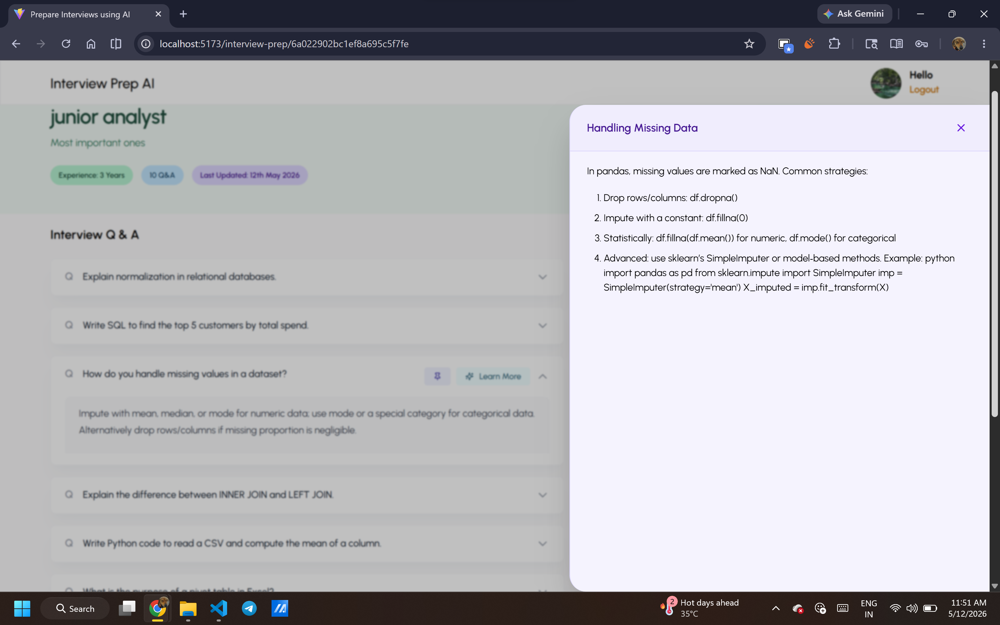

# AI Interview Prep

A full-stack interview preparation platform built to help users practice technical interviews and get AI-generated feedback on their responses.

The project was built using the MERN stack with OpenAI integration for generating interview-related content and feedback.

---

## Live Demo
- Live Website: https://ai-interview-prep-ten-nu.vercel.app
-GitHub Repository: https://github.com/yyogeshhkumar/AI-Interview-Prep

---

## Demo Credentials

You can use the following demo account to explore the application:

 Email: Johnsingh@gmail.com
 Password: 12345678

Note: 
- The demo account contains sample interview sessions and AI-generated responses for demonstration purposes.
- AI-generated responses may occasionally fail due to limited API usage credits on the free tier.
- Please avoid modifying account credentials or deleting existing demo data.


## Features

- User authentication
- Practice interview sessions
- AI-generated interview questions
- AI feedback based on responses
- Interview history tracking
- Responsive UI

---

## Tech Stack

### Frontend
- React.js
- Vite
- Tailwind CSS

### Backend
- Node.js
- Express.js
- MongoDB

### Other Tools
- OpenAI API
- JWT Authentication

---

## Project Structure

```bash
frontend/   # React frontend
backend/    # Express backend
```

---

## Setup Instructions

### Clone the repository

```bash
git clone https://github.com/yyogeshhkumarr/AI-Interview-Prep.git
```

---

### Install dependencies

Frontend:

```bash
cd frontend
npm install
```

Backend:

```bash
cd backend
npm install
```

---

## Environment Variables

Create a `.env` file inside the backend folder.

```env
MONGO_URI=your_mongodb_uri
JWT_SECRET=your_secret
OPENROUTER_API_KEY=your_api_key
CLIENT_URL=http://localhost:5173
```

---

## Run the application

Start backend server:

```bash
cd backend
npm run dev
```

Start frontend:

```bash
cd frontend
npm run dev
```

---

## Screenshots

### Home page 


### Sign Up 


### Dashboard


### Ai Questions Generation


### AI Explainatioin Generation



---

## Future Improvements

Some features I plan to add later:

- Voice-based interview practice
- Resume analysis
- More detailed analytics
- Better mobile responsiveness

---

## License

This project is licensed under the MIT License.